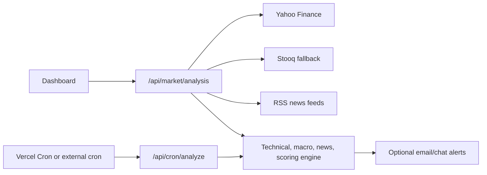

# GOLD AI ANALYST Architecture

## Runtime Model

The application is a Vercel-first Next.js App Router project.

- Dashboard pages are React client components hosted by Vercel.
- Market analysis runs in Node.js Route Handlers, not browser code.
- `/api/health` runs on the Edge runtime because it has no Node.js dependency.
- `/api/market/analysis` fetches public data, computes indicators, scores confluence, and returns a report.
- `/api/cron/analyze` runs the same scan and sends optional alerts.

## Data Flow

## Vercel Constraints

Vercel does not run permanent background processes. Continuous analysis is modeled as short serverless invocations triggered by user refresh, Vercel Cron, or an external scheduler. The included `vercel.json` uses a daily cron schedule to stay deployable on Hobby plans. For minute-level scans, use Vercel Pro cron or an external scheduler that calls `/api/cron/analyze`.

## Persistence

The default deployment is stateless to keep first deploy setup minimal. Signal persistence can be added with Vercel Marketplace storage, Neon, Supabase, or Upstash without changing the dashboard contract.
